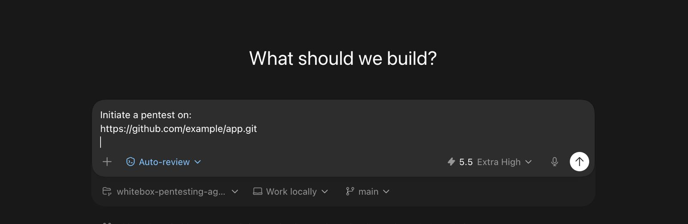
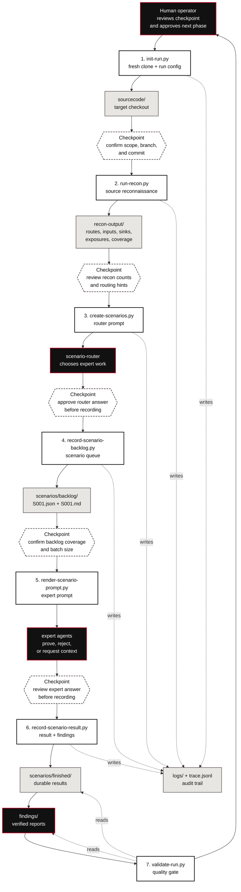

<p align="center">
  
</p>

<h1 align="center">Hadrian Whitebox Pentesting Agent</h1>

<p align="center"><em>A lightweight, file-based workspace for source-guided whitebox security review.</em></p>

[](LICENSE)
[](https://www.python.org/)

`whitebox-pentesting-agent` is built around agents, but the durable state is plain
files: cloned source, recon items, scenario prompts, scenario results, findings,
and logs. It runs inside an existing model harness — Claude Code, Codex, Cursor,
or a custom runner — which provides the model execution, terminal, repository
access, and human-in-the-loop approval. This tool provides the durable workflow
and review artifacts.

**The core idea:** checkpointed, scenario-first review. Recon discovers surfaces,
a router agent turns them into scoped scenarios, expert agents prove or reject
each scenario, and verified results become findings. The human approves every
phase transition.

---

<p align="center">
  
</p>

## Quick Start

The easiest way to get started is to open this repository in a coding harness
such as Codex, Claude Code, or Cursor and ask it:

```text
Initiate a whitebox pentest on https://github.com/example/app.git
```

The harness should follow `AGENTS.md`: initialize a run, summarize each
checkpoint, and ask before moving to the next phase.

**Manual CLI flow:** install the CLI from the repository root:

```bash
python3 -m pip install -e .
```

**2. Walk through a run.** Execute one command at a time. Each command prints a
checkpoint summary and the next command to run — review the output and approve
before continuing.

```bash
# Create a run from a fresh git checkout
whitebox init-run demo https://github.com/example/app.git --run-id demo-001

# Reconnaissance: discover routes, sinks, inputs, exposures
whitebox run-recon demo demo-001

# Optional: enrich recon with bundled Semgrep rules
whitebox run-recon demo demo-001 --semgrep

# Build the scenario-router prompt from recon output
whitebox create-scenarios demo demo-001

# Record the router agent's selected backlog
whitebox record-scenario-backlog demo demo-001 router-result.json

# Render a scenario prompt for an expert agent
whitebox render-scenario-prompt demo demo-001 S001

# Record an expert's verified result (materializes findings/)
whitebox record-scenario-result demo demo-001 S001 result.json

# Resume or hand off: prints current counts + next checkpoint
whitebox summarize-run demo demo-001
```

> **Resuming a run?** Run `whitebox summarize-run <target> <run-id>` to see counts
> and the next checkpoint command without executing anything.

Set `WHITEBOX_AGENT_ROOT` to this workspace path if you invoke the CLI from
outside the repo root. See [`docs/QUICKSTART.md`](docs/QUICKSTART.md) for more
detail.

---

## How It Works

The durable chain is always:

```text
recon item  →  scenario  →  result  →  finding
```

Everything is deliberately small: commands create files, agents read those files,
and the human approves each phase before the next command runs.



---

## Core Concepts

| Artifact | What it is |
|---|---|
| **Recon item** | A discovered place worth review — a route, sink, auth boundary, manifest, upload handler, or parser entrypoint. |
| **Scenario** | One recon item + one expert + one proof question. The same file may appear in multiple scenarios when multiple root-cause experts are relevant. |
| **Finding** | A verified vulnerability. One scenario can produce multiple findings when separate parameters, sinks, or trust boundaries are independently vulnerable. |

**Findings are accepted only when recorded through `scenarios/finished/` and
`findings/`.** Do not start a pentest with a broad LLM source sweep — the contract
is command-first and artifact-first.

Logs are audit artifacts, not private reasoning transcripts: what was done, what
evidence was used, what decision was made, status, and handoffs.

---

## Command Reference

Run commands from the repository root (or set `WHITEBOX_AGENT_ROOT`). The
`python3 scripts/commands/*.py` wrappers remain supported for legacy workflows.

| Command | Purpose |
|---|---|
| `whitebox init-run <target> <git-url> [--run-id <id>] [--branch <branch>]` | Clone the target into a fresh run workspace. |
| `whitebox run-recon <target> <run-id> [--semgrep]` | Source reconnaissance; `--semgrep` adds bundled rule hints. |
| `whitebox create-scenarios <target> <run-id>` | Build the scenario-router agent prompt from recon output. |
| `whitebox record-scenario-backlog <target> <run-id> <router-result.json>` | Materialize the router's selected backlog into `scenarios/backlog/`. |
| `whitebox render-scenario-prompt <target> <run-id> <S###>` | Render a scenario prompt for an expert agent. |
| `whitebox record-scenario-result <target> <run-id> <S###> <result.json>` | Record a verified result; materializes any findings. |
| `whitebox record-scenario-result <target> <run-id> <bundle.json>` | Record a multi-scenario bundle (top-level `results` array). |
| `whitebox summarize-run <target> <run-id>` | Print current counts and the next checkpoint command. |
| `whitebox log-event <target> <run-id> <actor> <status> <summary>` | Append an operational log event. |
| `whitebox validate-run [<target> <run-id>]` | Validate the whole repo or a specific run. |

### What recon produces

`run-recon` writes `recon-items.jsonl` plus lightweight `routes.jsonl`,
`inputs.jsonl`, `sinks.jsonl`, `exposures.jsonl`, and `coverage-gaps.json`. With
`--semgrep`, raw `semgrep-results.json` is also written and normalized into the
same recon items and routing requirements. **Semgrep hits are hints, not verified
vulnerabilities.**

### What the router does

`create-scenarios` does not create final scenarios itself. It writes
`runs/<target>/<run-id>/scenarios/scenario-router-prompt.md`, which the
scenario-router agent answers with JSON containing top-level `scenarios` and
`coverage_decisions` arrays. `record-scenario-backlog` validates that every
recon path and path/expert requirement is either represented by a scenario or
explicitly explained by a coverage decision before materializing the backlog.

---

## Run Layout

Every run lives under `runs/<target>/<run-id>/`:

```text
runs/<target>/<run-id>/
  sourcecode/           Fresh git checkout for this run.
  recon-output/         Recon items: routes, sinks, manifests, etc.
  scenarios/
    backlog/            Scenario JSON and rendered expert prompts.
    finished/           Recorded scenario results.
  findings/             Verified findings for this run.
  logs/                 Structured event log.
  run-config.yaml       Target URL, commit, branch, workflow metadata.
  run-state.jsonl       Run lifecycle events.
  trace.jsonl           Structured agent and command trace.
```

`runs/**`, `sourcecode/`, nested `sourcecode/`, and `targets/` are gitignored so
target code and review artifacts never get committed.

---

## Repository Structure

```text
config/                            Registry, defaults, and schema contracts.
agents/
  orchestration/                   Run lifecycle, scenario routing, finding triage.
  reconnaissance/                  Source recon agents that emit recon items.
  experts/                         Root-cause vulnerability-class experts.
  shared/                          Protocol all agents follow.
scripts/commands/                  Compatibility wrappers for the public commands.
src/whitebox_pentesting_agent/     Shared implementation and packaged CLI.
templates/                         Scenario, result, finding, recon-item templates.
docs/                              Operating model and quickstart notes.
runs/                              Generated run workspaces (gitignored).
```

Shared Python lives in `src/`; `scripts/commands/` files remain as stable command
wrappers for model harnesses and existing workflows.

---

## Agent Model

Agents are Markdown manifests — intentionally compact, but each expert must be
operational. It states when it should receive a scenario, what evidence proves or
rejects the vulnerability class, common false positives, and where to handoff
cross-class leads.

The workflow roles:

- **Orchestration agents** own run lifecycle, scenario routing, and finding triage.
- **Reconnaissance agents** find surfaces — routes, files, sinks, auth boundaries,
  upload paths, parser entrypoints, manifests, and debug/admin areas.
- **Expert agents** own root-cause vulnerability classes. The current registry
  defines **30 expert classes** in `config/agents.json`.

> **Surfaces are not expert ownership labels.** API, GraphQL, upload, parser,
> admin, and native boundaries are recon signals that fan out to multiple
> experts. Impacts like RCE or account takeover are finding impacts. A verified
> finding must name one primary root-cause owner.

---

## Development

Validate the workspace or a specific run:

```bash
whitebox validate-run
whitebox validate-run <target> <run-id>
```

See [`AGENTS.md`](AGENTS.md), [`CONTRIBUTING.md`](CONTRIBUTING.md), and
[`docs/OPERATING_MODEL.md`](docs/OPERATING_MODEL.md) for deeper documentation.

---

## Disclaimer

A note before you use this: this project is an experimental research prototype, provided as-is and without warranty of any kind. It is not a security product, has not been independently audited, and is not intended to be relied upon for any decision involving the security, safety, or correctness of software. It will miss real vulnerabilities and may report issues that do not exist. It is not a substitute for a professional security audit, manual code review, or established static analysis tools, and should never be used as a sole or primary means of assessing risk. By using it, you accept full responsibility for any outcomes, and the authors disclaim all liability for any damages, losses, or consequences arising from its use.

## License

MIT. See [`LICENSE`](LICENSE).
